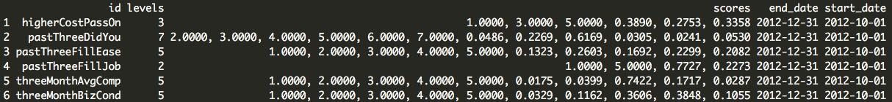
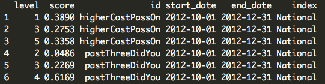
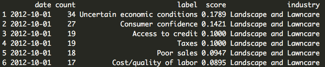
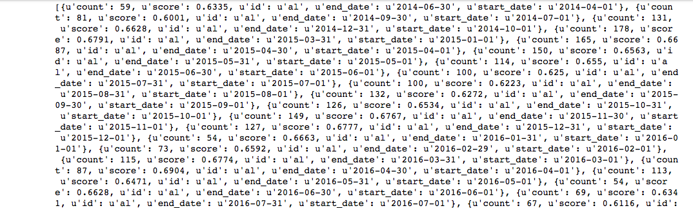
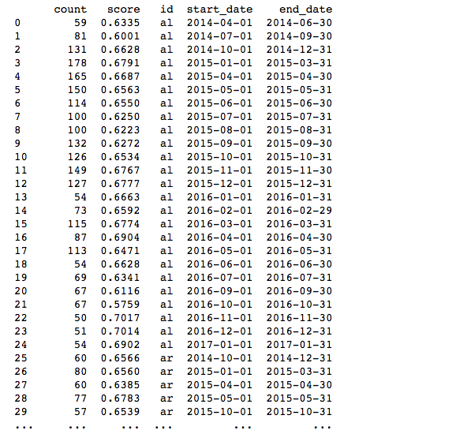
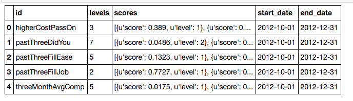
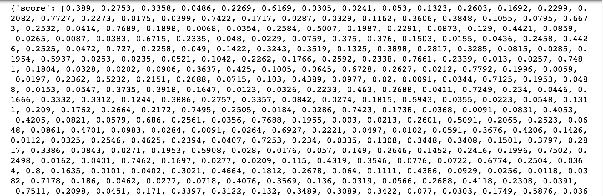
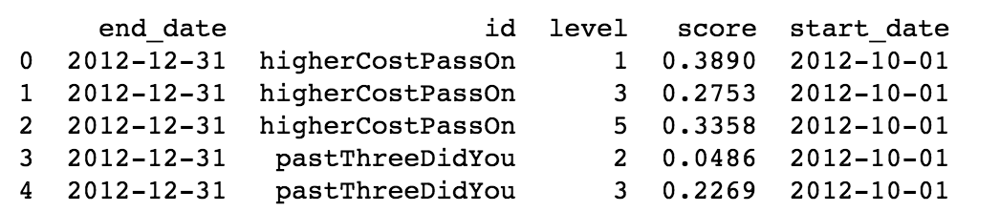

## <span style="color: #F27802">Accessing Thumbtack's Economic Sentiment Survey Data</span>
**TL;DR**: How to pull JSON data from our Economic Sentiment Survey [website](https://www.thumbtack.com/survey#/sentiment!context=states&index=1&industry=0&view=absolute) via R and Python      

# Table of Contents   
1. [Overview of Thumbtack's Economic Sentiment Survey (ESS)](#summary)     
    * [What is ESS?](#what-is-ess?)     
    * [How the data is collected](#how-the-data-is-collected)    
    * [How the data is measured](#how-the-data-is-measured)      
    * [How the data is stored](#how-the-data-is-stored)   
2. [Data Dictionary and Sources](#data-dictionary-and-sources)   
    * [Demographics](#demographics)   
    * [Industry](#industry)     
    * [Data Source 1](#data-source-1)     
    * [Data Source 2](#data-source-2)     
    * [Data Source 3](#data-source-3) 
    * [Methodology](#methodology)   
3. [Access the data via R](#how-to-access-ess-data-via-r)
4. [Access the data via Python](#how-to-access-ess-data-via-python)      
        
###Overview of Thumbtack's Economic Sentiment Survey (ESS)     
####What is ESS?

Every month, the [Thumbtack Economic Sentiment Survey](https://www.thumbtack.com/survey#/sentiment) captures the attitudes and perspectives of thousands of business owners from across the country to gauge how they are feeling about the economy and their businesses. Designed in coordination with economists at Bloomberg in 2012, Thumbtack's Economic Sentiment Survey captures a ground-level view of the economy in all 50 states. These business owners we hear from in this survey work in a variety of service-based industries, with occupations such as general contractor, interior designer, photographer, and personal trainer. They are demographically and politically diverse: over 30% are non-white, 40% are female, and there are a near-identical number of self-identified Democrats and Republicans (24.65% and 24.32%, respectively). These respondents are largely mobile service professionals with five or fewer employees who operate in households across the United States. Because they are hard to reach, these professionals are frequently overlooked in other surveys of small businesses. 

####How the data is collected####

We administer this survey through an online, in-product survey portal, prompting small business owner-operators to take it by by displaying a banner at the top of their user dashboard. The survey is fielded for one week in the middle of every month, with the results posted on the Monday before the first Friday of every month. This is meant to synchronize with the monthly release by the Bureau of Labor Statistics of the national [Employment Situation](https://www.bls.gov/news.release/empsit.toc.htm). On average, we receive between 5,500 and 6,500 responses per month.     
        
####How the data is measured####

Based on the responses to the survey in each period, Thumbtack and Bloomberg have constructed two indexes that we hope will be able to track activity among small service professionals over time – a Small Business Sentiment Index and a Small Business Inflation index.

These Indexes represent our current best estimates of where the strongest signal can be taken from the survey data collected to date – we expect to update the weights applied and formulas as more data comes in.

An individual index number is computed for each question in each period using the following formulas:

* For questions with three point scales:
   - `(%_positive_response) + (0.5*(%_neutral_response))`
* For questions with a five point scale:
   - `(%_positive_response + %_very_positive_response) + (0.5*(%_neutral_response)`
* For questions with true/false answers, only the percentage of positive answers was used.

These indexes are combined into a Sentiment Index, comprised of the following 8 questions, each weighted accordingly:
* Current Financial Condition (0.17 weight) 
* Financial Condition in 3 months (0.17 weight)
* Economic Condition in 3 months (0.08 weight)
* Profitability Expectations in 3 months (0.13 weight)
* Job openings in the past 3 months (0.08 weight)
* Employment change expected in 3 months (0.17 weight)
* Expected credit conditions (0.08 weight)
* Expected capital expenditures (0.13 weight)

A separate Inflation Index is composed of the following 3 questions with weights in parenthesis:
* Price Expectations (0.5 weight)
* Inflation pass-thru (0.333 weight)
* Wage plans (0.167 weight)

In addition to the national index scores, states and cities were chosen for comparison with each other. Cities are defined by the borders of their Core-Based Statistical Area, as defined by the [Office of Management and Budget](https://www.census.gov/population/metro/data/metrodef.html). Only cities and states with more than 50 respondents in any given period were chosen for comparison.

####How the data is stored####


        

###Data Dictionary and Sources###     
####Demographics####      
    Gender    
    1 = Female  
    2 = Male  
                
    Age  
    1 = Under 25  
    2 = 25 - 34  
    3 = 35 - 44  
    4 = 45 - 54   
    5 = 55 - 64  
    6 = 65 or above    
        
    Origin   
    1 = Hispanic, Latino, or Spanish   
    2 = Asian   
    3 = Other   
    4 = White (Caucasian)  
    5 = Black or African American   
          
    Employer    
    1 = Non-employer  
    2 = Small Employer   
    3 = Large Employer   


####Industry####        
    0 = All Industries      
    1 = Landscaping & Lawncare      
    2 = Transportation and Moving     
    3 = Wellness         
    4 = Lessons     
    5 = Pet Care    
    6 = Cleaning    
    7 = Events    
    8 = Home Improvement      
    9 = Personal Services     
    10 = Professional Services      
    11 = Photography      
    
####Data Source 1####
Sentiments Data (State or CBSA View)            
        
 Field         | Definition      
 ------------- | -------------       
 `id`          | (chr) state or cbsa     
 `start_date`  | (chr) survey start date   
 `end_date`    | (chr) survey end date      
 `count`       | (int) sample size   
 `score`       | (num) sentiment index value ranging from (0-1) based on 8 survey questions and weighted accordingly (see ESS methodology doc. for details)       
   
      
####Data Source 2####             
Question Scores           

Field          |  Definition      
-------------  |  ----------------      
`id`           |  (chr) survey question id     
`levels`       |  (int) number of levels         
`scores`       |  (list) level = level number of answer; score = answer proportion selected by survey participants      
`end_date`     |  (chr) survey end date     
`start_date`   |  (chr) survey start date     
        
             
#####Questions: (`id`)#####       
The ESS asks 15 survey questions that are displayed on Thumbtack's survey website every month. The following section defines `id` and matches its subject heading on the survey site which corresponds to the survey questions and answers.       
        
For example:      
'Cost passed on to customers' is the subject heading on the survey site, which corresponds to id `higherCostPassOn` and the question
"If your costs increased 5% today, how much of that cost increase could you pass on to customers through higher prices?" with three levels.     
        
          
              
Costs passed on to customers (`higherCostPassOn`)       
```
If your costs increased 5% today, how much of that cost increase could you pass on to customers through higher prices?   
    1 = Little or none of the cost increase         
    3 = About half of the cost increase     
    5 = All or most of the cost increase    
```       
      
Availability of credit (`pastThreeDidYou`)
```
During the past three months did you:   
    1 = Seek credit but were turned down or denied
    2 = Seek credit but refuse it because of the terms or conditions attached   
    3 = Not seek credit because you didn't think your loan application would be approved  
    4 = Not seek credit because you didn't need it      
    5 = Seek credit and receive some of the amount needed   
    6 = Seek credit and receive most of the amount needed     
    7 = Seek credit and receive the full amount needed    
```
      
Difficulty of hiring new people (`pastThreeFillEase`)                
```
How difficult or easy was it to fill the full-time or part-time job openings(s) over the past three months?   
    1 = Very difficult   
    2 = Somewhat difficult   
    3 = Neither easy nor difficult          
    4 = Somewhat easy      
    5 = Very easy   
```

Any recent hires? (`pastThreeFillJob`)            
```
Have you filled or attempted to fill any full-time or part-time job openings over the past three months?    
    1 = No      
    2 = Yes     
```
      
Change in employee compensation (`threeMonthAvgComp`)      
```
How do you expect your average employee compensation to change over the next three months?
    1 = Decrease a lot
    2 = Decrease a little
    3 = Stay about the same     
    4 = Increase a lot 
    5 = Increase  a little         
```
          
Outlook on business conditions (`threeMonthBizCond`)           
```
How do you think business conditions in the general economy will be in three months, compared with the conditions now?    
    1 = Much worse than they are now          
    2 = A little worse than they are now      
    3 = About the same as they are now      
    4 = A littler better than they are now      
    5 = Much better than they are now     
```

Outlook on expenditures (`threeMonthCapExpChange`)      
```
How do you exepct your capital expenditures to change over the next three months?   
    1 = Decrease        
    3 = Stay about the same     
    5 = Increase       
```
      
Outlook on number of employees (`threeMonthEmpChange`)          
```
How do you expect the total number of employees in your business to change over the next three months?    
    1 = Decrease          
    3 = Stay about the same       
    5 = Increase        
```

Financial outlook (`threeMonthFinSit`)      
```
How do you think your company's financial situation will be in three months from now?       
    1 = Substantially worse     
    2 = A little worse    
    3 = About the same as today   
    4 = A little better   
    5 = Substantially better      
```

Outlook on getting loans (`threeMonthHardLoans`)            
```
Do you expect to find it harder or easier to get loans in three months than it is now? 
    0 = I don't know    
    1 = Much harder in three months     
    2 = A little harder in three months     
    3 = About the same      
    4 = A little easier in three months     
    5 = Much easier in three months       
```
    
      
Change of prices charged (`threeMonthPriceChange`)       
``` 
How do you expect the prices you charge your customers or clients to change over the next three months?   
    1 = Decrease by more than 10%     
    2 = Decrease by 1-10%   
    3 = Stay about the same        
    4 = Increase by 1-10%       
    5 = Increase by more than 10%         
```
      
               
Outlook on profitability (`threeMonthProfitChange`)
```
How do you expect your company's profitability (net earnings after taxes) to change over the next three months?     
    1 = Decrease by more than 10%         
    2 = Decrease by 1-10%       
    3 = Stay about the same       
    4 = Increase by 1-10%     
    5 = Increase by more than 10%       
```

          
Revenue outlook (`threeMonthRevChange`)           
```     
How do you exect your company's revenues to change over the next three months?        
    1 = Decrease by more than 10%           
    2 = Decrease by 1-10%       
    3 = Stay about the same       
    4 = Increase by 1-10%     
    5 = Increase by more than 10%      
```

                      
Change in employee education (`threeMonthTrainingChange`)            
```
How do you expect your expenditures to improve your or your employees' training, education or expertise about your business to change over the next three months?
    1 = Decrease    
    3 = Stay about the same     
    5 = Increase          
```
          
Financial situation today (`todayFinSit`)           
```
How would you rate your company's financial situation today?
    1 = Very bad      
    2 = Somewhat bad    
    3 = Neither good nor bad      
    4 = Somewhat good     
    5 = Very good       
```          
          
####Data Source 3####            
Top Problems              
          
Field          |   Definition      
-------------  |   ----------------        
`date`         |   (chr) survey month and year     
`count`        |   (int) sample size     
`label`        |   (chr) top problem of concern for survey participants     
`score`        |   (num) proportion of survey participants who selected problem type       
        
      
####Methodology####     
Sentiments Scores data only pulls data at states and cbsa level for sample sizes >= 50.     
         
        
        

###How to access ESS data via R###          
          
Steps:      
1. Request the data from ESS API using `GET()` from the `httr` library        
2. Check status of the response. If you're pulling data via multiple iterations then implement either `warn_for_status(x)` or `stop_for_status(x)`.          
3. If status is OK (200), then proceed to convert the data from response from JSON character string to an R object using `content()` as type `text`        
4. Then convert JSON character string to an R object using `fromJSON()` function from the `jsonlite` library              
5. Assign index labels to each data pull (refer to data dictionary above)   
6. Save as dataframes or export as .csv files for offline analysis      
      
#####Data Source 1: Sentiments Data#####      
Sample File: https://data.thumbtack.com/v1/sentiments/states      

Here is a basic example on how to pull sentiment scores data at the states level. The same can be applied to CBSAs.
```r
library(httr) # functions to send request to ESS API
library(jsonlite) # to convert json data type to R object 

ss_url <- modify_url(paste0("https://data.thumbtack.com/v1/sentiments/states?"))
ss_response <- GET(ss_url)
warn_for_status(ss_response)
ss_text <- content(ss_response, "text")
ss_data <- fromJSON(ss_text, flatten = TRUE)$data


```

Here is a more complex example of pulling all sentiment scores by demographic variables: gender, age, origin, and employer.      
```r
demographics <- c("gender", "age", "origin", "employer")
demographics_levels <- c(2, 6, 5, 3)

demographics_df <- data.frame(demographics, demographics_levels)

for(h in 1:nrow(demographics_df)) {
  
  dem <- demographics_df$demographics[h]

  s_data <- c()
  for(i in 1:demographics_df$demographics_levels[h]){
    s_url <- modify_url(paste0("https://data.thumbtack.com/v1/sentiments/states?", dem, "=", i , "&index=1&industry=0"))
    s_response <- GET(s_url)
    warn_for_status(s_response)
    s_text <- content(s_response, "text")
    s_data_i <- fromJSON(s_text, flatten = TRUE)$data
    s_data_i$index <- i
    s_data <- rbind(s_data, s_data_i)
  }

#Assign labels to the age category codes:
if(dem == "gender"){
    gender_code <- c(Female = 1, Male = 2)
    s_data$gender <- names(gender_code)[match(s_data$index, gender_code)]
} else if (dem == "age"){
    age_code <- c(`Under 25`= 1, `25-34` = 2, `35-44` = 3, `45-54` = 4, `55-64` = 5, `65 or above` = 6)
    s_data$age <- names(age_code)[match(s_data$index, age_code)]
} else if (dem == "origin"){
    origin_code <- c(`Hispanic, Latino, or Spanish` = 1, `Asian` = 2, `Other` = 3, `White (Caucasian)` = 4, `Black or African American ` = 5)
    s_data$origin <- names(origin_code)[match(s_data$index, origin_code)]
} else {
    employer_code <- c(`Non-employer` = 1, `Small Employer` = 2, `Large Employer` = 3)
    s_data$employer <- names(employer_code)[match(s_data$index, employer_code)]
}

write.csv(s_data, paste("s_", dem , "_data.csv", sep = ""), row.names = FALSE)
}
```
          
#####Data Source 2: Question Scores#####          
Sample File: https://data.thumbtack.com/v1/question-scores      
Note that column `scores` is type list.  
```r
library(plyr) # to convert list to dataframe

qs_response <- GET("https://data.thumbtack.com/v1/question-scores")
warn_for_status(qs_response)
qs_text <- content(qs_response, "text")
qs_df <- fromJSON(qs_text, flatten = TRUE)$data

str(qs_df) # check type of each column 
```

        
              
Given that the `scores` column in this data is a list, we want to reshape the data. We can manipulate each item in the list by appending the information in the row of the nested list to each element in the list. Then, we convert this updated list to a data frame.         
```r
s <- qs_df$scores

for(i in 1:length(s)) {
    s[[i]]$id <- qs_df$id[i]
    s[[i]]$start_date <- qs_df$start_date[i]
    s[[i]]$end_date <-  qs_df$end_date[i]
}

s_df <- ldply(s, data.frame) # convert s to dataframe
s_df$index <- "National"
```        
   


          
#####Data Source 3: Top Problems#####       
Sample File: https://data.thumbtack.com/v1/top-problems        
Example of pulling all top problem metrics at the industry level for "Landscape and Lawncare"       
```
tp_response <- GET("https://data.thumbtack.com/v1/top-problems?index=1&industry=1")
warn_for_status(tp_response)
tp_text <- content(tp_response, "text")
tp_df <- fromJSON(tp_text, flatten = TRUE)$data
tp_df$industry <- "Landscape and Lawncare"
```
         
              
###How to access ESS data via Python###  
####Steps####
1. Import relevant libraries (`json`, `pandas`, `requests`)     
2. Request the data from ESS API using `requests.get()`   
3. Import the JSON data using .json()
4. Convert data to a dataframe using `pandas.DataFrame()` 

```python
import json   # to deal with json objects
import pandas as pd # to convert to dataframe and complete analysis
import requests # to make http request


url = "https://data.thumbtack.com/v1/sentiments/states"
sentiment_states = requests.get(url)
sentiment_states.status_code # check that status code is OK (200)
sentiment_states.headers # check the content-type this response; confirm that it's type json
sentiment_states_data = sentiment_states.json() # import json data
print(sentiment_states_data['data'])  # check the data
```
          
     

Convert json data to a dataframe      
```python        
sentiment_states_df = pd.DataFrame(sentiment_states_data['data'], columns= ['count', 'score', 'id', 'start_date', 'end_date'])

print(sentiment_states_df)
```      
       
          
The sentiments data is now ready for analysis!        
          
#####Dealing with Nested Lists####
The question scores data needs some restructuring for analysis. Take a look at the `scores` column in the the dataframe below: 
```python
url2 = "https://data.thumbtack.com/v1/question-scores"
question_scores = requests.get(url2)
question_scores.status_code
question_scores.headers
question_scores_data = question_scores_data.json()

question_scores_df = pd.DataFrame(question_scores_data, columns= ['id', 'levels', 'scores', 'start_date', 'end_date'])
question_scores_df.head() 
```

                  
            
Notice how the column `scores` is a list of dictionaries with key values `level` and `score`. We want to restructure the data so that each field is its own column in a dataframe:

```python
new_qs_data = {'id': [], 'start_date': [], 'end_date': [], 'level' : [], 'score' : []}

for i in question_scores_data['data']:

    id_vals = i['id']
    start_date_vals = i['start_date']
    end_date_vals = i['end_date']
    
    for j in i['scores']:
        level_vals = j['level']
        score_vals = j['score']

        new_qs_data['level'].append(level_vals)   
        new_qs_data['score'].append(score_vals)
        
        new_qs_data['id'].append(id_vals)
        new_qs_data['start_date'].append(start_date_vals)
        new_qs_data['end_date'].append(end_date_vals)

print new_qs_data
```
  

```python
testing_df2 = pd.DataFrame(new_qs_data) # convert dictionary to dataframe
print testing_df2.head() # preview dataframe
```
  
We now have the structure we want. The final step is to reorder the columns if needed.      

```python
testing_df3 = testing_df2[['id', 'level', 'score', 'start_date', 'end_date']] # reorder dataframe columns
print(testing_df3.head()) # preview updated dataframe
```

  

And now the question scores data is ready to be further analyzed in Python!

        
#### Curious to Learn More About The Data? ####        
Check out the [ESS survey website](https://www.thumbtack.com/survey#/sentiment!context=states&index=1&industry=0&view=absolute) for an interactive view of this data and [monthly reports](https://www.thumbtack.com/blog/economic-sentiment-feb-2017/) on economic sentiments of Thumbtack Pros.  
